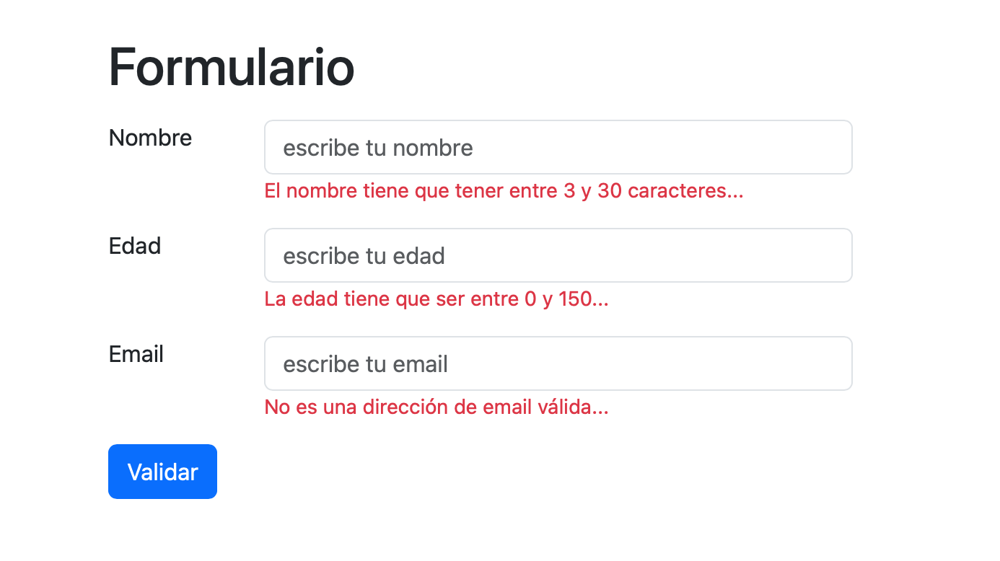

# Modificar el DOM

## 1

Crea una página HTML con el siguiente contenido:

```html
<h1>Lorem ipsum dolor sit amet </h1>
<h2>Nam gravida ultrices nisi non porttitor.</h2>
<p>Sed justo <span class="importante">mauris</span>, luctus id lorem at, egestas condimentum leo. Nam in diam id felis
    lacinia non eu enim. Donec pulvinar neque convallis.</p>
<p>Neque <span class="importante">congue</span> iaculis. Nam vel sem sit amet ligula </a>mollis semper id eu mauris. Nam
    gravida ultrices nisi non porttitor. Vestibulum a <span class="importante">vehicula</span> risus. Nunc ut imperdiet
    mauris.</p>
```

1. Cambia el color de fondo del cuerpo de la página utilizando JavaScript.
2. Selecciona el elemento `h2` de la página y cambia su color de texto a `#ff0000`.
3. Establece la propiedad `font-weight` a 700 en los elementos de clase `importante`.

## 2

Genera una lista HTML con los datos de un objeto como el siguiente:

```javascript
const estudiante = {
    nombre: 'Amaia',
    apellidos: 'Jainaga Urrutia',
    edad: 27,
    email: 'amaia@email.com'
}
```

## 3

Genera una tabla HTML a partir de los datos almacenados en un array de objetos con la siguiente estructura:

```javascript
const tareas = [
    {
        id: 1,
        descripcion: 'Primera tarea',
        responsable: 'Mikel',
        fecha: '03-10-2020'
    },
    {
        id: 2,
        descripcion: 'Segunda tarea',
        responsable: 'june',
        fecha: '07-10-2020'
    },
]
```

## 4

Usando Bootstrap, crea un formulario como este:



Escribe el código necesario para que, al pulsar en el botón `Validar`, se compruebe que el contenido de cada campo sea
correcto y, si no, se muestre el mensaje que aparece en rojo.

> Utiliza la clase `d-none` de Bootstrap para ocultar los mensajes hasta el momento adecuado.
